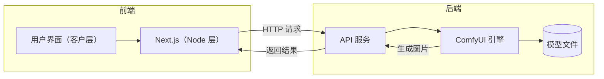

# Comfy Docker

一个基于 Docker 的 ComfyUI 弹性 Serverless 应用，提供完整的前后端分离架构和用户友好的界面。

Demo:<https://hadoop.nexmoe.com/>

## 项目特点

- 🐳 完整的 Docker 化部署方案
- 🎨 现代化的前端界面
- 🔌 模块化的后端架构
- 🛠 简单的配置和使用方式

## 架构图



## 项目结构

```
comfy-docker/
├── frontend/           # Next.js 前端项目
│   ├── src/           # 源代码
│   └── .env          # 环境配置
├── backend/           # ComfyUI 后端
│   ├── checkpoints/   # 模型检查点
│   ├── controlnet/    # ControlNet 模型
│   ├── custom_nodes/  # 自定义节点
│   └── loras/        # LoRA 模型
└── bruno/            # API 测试文件
```

backend/ 目录结构如下，模型 和 自定义节点 需要自行下载安装

```
.
├── Dockerfile
├── checkpoints
│   └── dreamshaperXL_sfwV2TurboDPMSDE.safetensors
├── controlnet
│   ├── sai_xl_canny_256lora.safetensors
│   └── sai_xl_depth_256lora.safetensors
├── custom_nodes
│   ├── ComfyUI-Custom-Scripts
│   ├── ComfyUI-WD14-Tagger
│   ├── ComfyUI_Comfyroll_CustomNodes
│   ├── comfyui-art-venture
│   └── comfyui_controlnet_aux
├── docker-compose.yml
├── loras
│   └── StudioGhibli.Redmond-StdGBRRedmAF-StudioGhibli.safetensors
├── provisioning.sh  // 自定义脚本
└── sanhua.json  // 工作流
```

## 环境要求

- Docker & Docker Compose
- NVIDIA GPU（当前演示工作流需要 12G 显存以上）
- 足够的磁盘空间（100G~200G）用于存储模型

## 快速开始

### 后端本地测试

1. 进入后端 Dockerfile 目录

```bash
cd backend
```

2. 下载模型文件

请参考：<https://www.gongjiyun.com/docs/docker/tutorials/comfyui.html>

3. 构建 Docker 镜像

```bash
docker build -t gongji/comfyui:0.1 .
```

1. 运行 Docker 容器

```bash
docker run -it --rm --gpus all -p 3000:3000 -p 8188:8188 --name comfyui gongji/comfyui:0.1
```

容器启动后可以访问：

- ComfyUI 界面：<http://localhost:8188>
- API 接口：<http://localhost:3000/docs>

### 前端本地测试

1. 进入前端目录

```bash
cd frontend
```

2. 配置环境变量

```bash
cp .env.example .env
# 编辑 .env 文件配置必要的环境变量
```

3. 安装依赖并启动

```bash
pnpm install
pnpm dev
```

## ComfyUI Docker 部署到 Serverless 弹性平台

请参考 [共绩科技的 ComfyUI 部署文档](https://www.gongjiyun.com/docs/docker/tutorials/comfyui.html)

## API 文档

项目使用 Bruno 进行 API 测试和文档管理，相关文件位于 `bruno/` 目录。

### ComfyUI API 调用示例

以下是调用 ComfyUI API 的示例代码（参考 `frontend/src/app/api/route.ts`）：

```typescript
async function generateImage(imageUrl: string) {
    // 1. 准备 prompt 数据
    const promptData = { ...promptob };  // 从 JSON 文件导入基础 prompt
    promptData.prompt["30"].inputs.image = imageUrl;  // 修改输入图片

    // 2. 设置请求选项
    const url = `${process.env.GONGJI_ENDPOINT}/prompt`;
    const options = {
        method: 'POST',
        headers: { 'content-type': 'application/json' },
        body: JSON.stringify(promptData)
    };

    // 3. 发送请求
    const response = await fetch(url, options);
    const data = await response.json();

    // 4. 错误处理
    if (response.status !== 200) {
        throw new Error(response.statusText);
    }

    // 5. 处理返回的图片数据
    if (data.images && data.images.length > 0) {
        return data.images[0];  // 返回 base64 格式的图片数据
    } else {
        throw new Error('没有返回有效的图片数据');
    }
}
```

主要步骤说明：

1. **准备 Prompt**：
   - 从 JSON 文件导入基础 prompt 配置
   - 根据需要修改 prompt 中的参数（如输入图片）

2. **发送请求**：
   - 使用 POST 方法
   - Content-Type 设置为 application/json
   - 请求体为序列化后的 prompt 数据

3. **处理响应**：
   - 检查响应状态码
   - 解析返回的 JSON 数据
   - 提取生成的图片（base64 格式）

4. **错误处理**：
   - 记录错误日志
   - 抛出适当的错误信息

### 环境变量配置

在使用 API 之前，确保配置以下环境变量：

```bash
GONGJI_ENDPOINT=your-comfyui-api-endpoint  # ComfyUI API 端点
```

## S3 配置说明

项目的图片上传功能需要配置 S3 存储服务。你可以使用 AWS S3 或其他兼容 S3 协议的对象存储服务（如 MinIO）。

在 `frontend/.env` 文件中配置以下环境变量：

```bash
S3_ENDPOINT=your-s3-endpoint
S3_ACCESS_KEY=your-access-key
S3_SECRET_KEY=your-secret-key
S3_BUCKET=your-bucket-name
S3_REGION=your-region
```

注意：

- 确保创建的 bucket 具有适当的访问权限
- 如果使用 MinIO，endpoint 应该是完整的 URL（例如：<http://localhost:9000）>
- 使用 AWS S3 时，可以省略 endpoint 配置

## 贡献指南

欢迎提交 Issue 和 Pull Request！

## 许可证

MIT License
